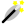
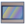
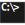

# MÉMENTO

## IMAGE // VIDEO
-  link:image/ffmpeg.adoc[ffmpeg]
,  link:image/convert.adoc[convert]
,  link:image/sensors.adoc[sensors]

## CODING
-  Scripting
: link:coding/batch/dos.adoc[dos]
, link:coding/batch/bash.adoc[bash]
, link:coding/batch/zsh.adoc[zsh]
-  windows : link:coding/windows/windows_cheat.adoc[cheat], link:coding/windows/chocolatey/chocolatey.adoc[chocolatey]
- image:coding/linux/icon_linux.svg["linux"] linux : link:coding/linux/linux_cheat.adoc[cheat], link:coding/linux/parallel.adoc[parallel]

- image:coding/python/icon_python.svg["PYTHON"] python
: link:coding/python/snippets.adoc[snippets]
, link:coding/python/argparse.adoc[argparse]
, link:coding/python/logging.adoc[logging]
, link:coding/python/path.adoc[path]
, link:coding/python/conda.adoc[conda]
, link:coding/python/datetime.adoc[datetime]
, link:coding/python/re.adoc[re]
, link:coding/python/matplotlib.adoc[matplotlib]
//, link:coding/python/vcvarsall.adoc[vcvarsall]

- image:coding/cpp/icon_cpp.svg["c++"] Cpp
: link:coding/cpp/rules.adoc[rules]
, link:coding/cpp/qmake.adoc[qmake]
, link:coding/cpp/cmake.adoc[cmake]
, link:coding/cpp/snippets.adoc[snippets]
, link:coding/cpp/algoithm.adoc[algoithms]

-  link:math/geometry.adoc[geometry]

## MISC.
-  link:misc/asciidoc/README.adoc[asciidoc]
-  link:misc/openssl.adoc[openssl]
-  link:misc/rsync.adoc[rsync]
-  link:misc/synology.adoc[synology]
-  link:misc/us_keyboard.adoc[keyboard]
-  link:misc/erl3.adoc[ERL3]
-  link:misc/octoprint.adoc[octoprint]
