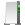
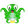

= MÉMENTO

== IMAGE // VIDEO
- image:image/icon_ffmpeg.svg["ffmpeg",link="image/ffmpeg.adoc"] link:image/ffmpeg.adoc[ffmpeg]
, image:image/icon_magick.svg["convert",link="image/convert.adoc"] link:image/convert.adoc[convert]
, image:image/icon_sensor.svg["sensors",link="image/sensors.adoc"] link:image/sensors.adoc[sensors]
, image:math/icon_geometry.svg["geometry"] link:math/geometry.adoc[geometry]

== CODING

- image:coding/windows/icon_windows.svg["windows"] windows
: link:coding/windows/dos.adoc[dos]
, link:coding/windows/windows_cheat.adoc[cheat]
, link:coding/windows/chocolatey/chocolatey.adoc[chocolatey]

- image:coding/linux/linux_icon.svg["linux"] linux
: link:coding/linux/linux_cheat.adoc[cheat]
, link:coding/linux/bash.adoc[bash]
, link:coding/linux/zsh.adoc[zsh]
, link:coding/linux/apptainer_cheat.adoc[apptainer]
, link:coding/linux/parallel.adoc[parallel]
, link:coding/linux/armbian.adoc[armbian]
, link:coding/linux/direnv.adoc[direnv]
, link:coding/linux/de-duplicate.adoc[de-duplicate]

- image:coding/python/icon_python.svg["PYTHON"] python
: [line-through]#link:coding/python/argparse.adoc[argparse]#
, link:coding/python/conda.adoc[conda]
, link:coding/python/datetime.adoc[datetime]
, link:coding/python/jsonargparse.adoc[jsonargparse]
, link:coding/python/logging.adoc[logging]
, link:coding/python/matplotlib.adoc[matplotlib]
, link:coding/python/path.adoc[path]
, link:coding/python/pyproj.adoc[pyproj]
, link:coding/python/pyproject.adoc[pyproject.toml]
, link:coding/python/re.adoc[re]
, link:coding/python/snippets.adoc[snippets]

- image:coding/cpp/icon_cpp.svg["c++"] Cpp
: link:coding/cpp/rules.adoc[rules]
, link:coding/cpp/qmake.adoc[qmake]
, link:coding/cpp/cmake.adoc[cmake]
, link:coding/cpp/snippets.adoc[snippets]
, link:coding/cpp/algorithm.adoc[algorithms]

== MISC.
-  link:misc/asciidoc.adoc[asciidoc]
-  link:misc/gmail.adoc[gmail]
-  link:misc/openssl.adoc[openssl]
- image:misc/docker_icon.svg["DOCKER"] link:misc/docker.adoc[Docker]
-  link:misc/rsync.adoc[rsync]
-  link:misc/synology.adoc[synology]
-  link:misc/us_keyboard.adoc[keyboard]
-  link:misc/erl3.adoc[ERL3]
-  link:misc/octoprint.adoc[octoprint]
