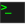

# MÉMENTO

## IMAGE // VIDEO
-  [ffmpeg](image/ffmpeg.md)
-  [convert](image/convert.md)
-  [sensors](image/sensors.md)

## CODING
-  [DOS](coding/batch/dos.md)
-  [BASH](coding/batch/bash.md)
-  python :  [argparse](coding/python/argparse.md) ,  [datetime](coding/python/datetime.md) ,  [path](coding/python/path.md) ,  [re](coding/python/re.md) ,  [snippets](coding/python/snippets.md) , [vcvarsall](coding/python/vcvarsall.md) , [xml](coding/python/xml.md)
-  C++ : [rules](coding/cpp/rules.md), [qmake](coding/cpp/qmake.md), [snippets](coding/cpp/snippets.md)
-  [geometry](math/geometry.md)

## MISC.
-  [markdown](misc/markdown.md)
-  [openssl](openssl.md)
-  [rsync](misc/rsync.md)
-  [synology](misc/synology.md)
-  [keyboard](misc/us_keyboard.md)
