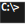

#  Chocolatey
:toc:

## Packages

[source,bat]
----
REM done
choco install -y 7zip --install-arguments='"/D=C:\bin\7-zip_"'
choco install -y firefox --install-arguments='/D=C:\bin\firefox'
choco install -y python3 --package-parameters="/InstallDir:C:\bin\python3"
choco install -y pycharm-community --install-arguments='/D=C:\bin\pycharm'
choco install -y mpc-hc --install-arguments='/DIR="C:\bin\MPC-HC"'
choco install -y notepadplusplus.install --install-arguments='/D="C:\bin\Notepad++"'
choco install -y foobar2000 --install-arguments='/D="C:\bin\foobar2000"'
choco install -y filezilla --install-arguments='/D="C:\bin\filezilla"'
choco install -y git --install-arguments='/DIR="C:\bin\git"'
choco install -y pandoc --ia='ALLUSERS=1' --install-arguments='APPLICATIONFOLDER="C:\bin\pandoc"'
choco install -y teracopy --install-arguments='/DIR="C:\bin\teracopy"'
choco install -y miniconda3 --params='/InstallationType:AllUsers' --params='/D:C:\bin\miniconda3'
choco install -y handbrake --install-arguments='/D=C:\bin\handbrake'
choco install -y avidemux --install-arguments='/D=C:\bin\avidemux'
choco install -y inkscape --install-arguments='INSTALLDIR=C:\bin\inkscape'
choco install -y virtualbox --params "/NoDesktopShortcut" --install-arguments='INSTALLDIR=C:\bin\virtualbox'
choco install -y cmake --install-arguments='INSTALL_ROOT=C:\bin\cmake'
choco install -y gitextensions --install-arguments="INSTALLDIR=C:\bin\gitextensions"
choco install -y imagemagick --install-arguments="/DIR=C:\bin\imagemagick"
choco install -y mobaxterm --install-arguments="INSTALLDIR=C:\bin\mobaxterm"
choco install -y windirstat  --install-arguments="/D=c:\bin\windirstat"
choco install -y meld --install-arguments="TARGETDIR=C:\bin\meld"
REM UNABLE to setup path
choco install -y putty --install-arguments="INSTALLDIR=C:\bin\putty"
choco install -y atom --install-arguments='/D="C:\bin\atom"'
choco install -y ffmpeg
----
