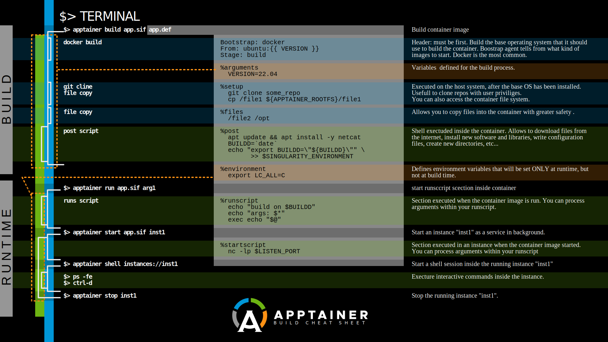

=  Apptainer [former singularity]
:author: Julien Morat
:email: julien.morat@gmail.com
:sectnums: 2
:toc:
:toclevels: 1
:experimental:

== install

== build a container

== examples

=== ssh

WARNING: logging through ssh will not trigger all the apptainer run/shell/exec 
mecanics (eg. /.singularity/actions/shell/

[source,ini]
.my_container.def
----
Bootstrap: docker
From: ubuntu:22.04

%appinstall ssh
    apt update && apt install -y openssh-server
    sed -i "s/UsePam yes/UsePam no/g" /etc/ssh/sshd_config
	echo "/.singularity/actions/shell" > /etc/ssh/sshrc
	
%apprun sshd
    /usr/sbin/sshd -p 2222 -D
----
.shell
[source,bash]
----
$> apptainer build my_container.sif my_container.def
$> apptainer instance start --bind $HOME/.ssh/id_rsa.pub:$HOME/.ssh/authorized_keys my_container.sif my_container
$> apptainer run --app ssh instance://my_container
# some ssh 127.0.0.1 
$> apptainer instace stop my_container
----

