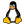

=  direnv (envrc)
:author: Julien Morat
:email: julien.morat@gmail.com
:sectnums: 2
:toc:
:toclevels: 1
:experimental:

== install

[source,bash]
----
curl -sfL https://direnv.net/install.sh | bash
# to be tested
----

== conda

..envrc
[source,bash]
----
layout anaconda <env_name>
----