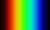
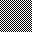

# image:icon_magick.svg["MAGICK", width=64px] Convert (magick)
:toc:

## Basic


```
convert <input_file> [<input_file> ...] <output_file>
```
:toc:

## Geometry

### rescale
simple rescale:
```
convert rose: -resize 50% rose.png
```

rescale with proper value interpolation (convert sRGB to RGB):
```
convert rose: -colorspace RGB -resize 50% -colorspace sRGB rose.png
```

### crop
```
convert rose: -crop 10x10+20+20 output_file.png
```

### shave
To specify the amount to be removed, use -shave instead:
```
convert rose: -shave 10% rose.png
```
Remove 10% pixels from the image edges.

### chop
Remove pixels from the interior of an image.
```
convert rose: -chop 20x0+10+0 rose.png
```
remove a vertical band of 20 pixels wide at 10 pixels from the left border.

### rotate
```
convert rose: -rotate 90 out.png
```
 * clockwise `-rotate 90`
 * anticlockwise `-rotate 270` ( -90 may work )

## Alpha channel

extract alpha
```
convert image.png -alpha extract alpha.png
```

extract RGB
```
convert image.png -flatten rgb.png
```

extract RGB with default RGB value
```
convert image.png -background black -alpha remove rgb.png
```

merge RGB and alpha
```
convert rgb.png alpha.png -alpha off -compose CopyOpacity -composite result.png
```

## Color-spaces

```
convert gamma_dalai_lama_gray.jpg -set colorspace sRGB -depth 16 -colorspace RGB -resize 50% -colorspace sRGB -depth 8  gamma_dalai_lama_gray.50pc.png
```

with steps:

 - `set colorspace sRGB` : Set metadata only, do not touch pixels.
 - `depth 16`            : Increase image precision.
 - `colorspace RGB`      : Transform pixels from existing colourspace (sRGB) to new colourspace (RGB), and update  metadata to be RGB.
 - `resize 50%`          : Now that pixels are in a linear space, resize should be safe.
 - `colorspace sRGB`     : Transform pixels from existing colourspace (RGB) to new colourspace (sRGB), and update colourspace metadata to be sRGB
 - `depth 8`             : Go back to original precision.


## Animate

```
convert -delay 10 frame1 frame2 out.gif
```

Patrol cycle (back and forth) just add ```-coalesce   -duplicate 1,-2-1```
```
convert -delay 10 frame frame2 -coalesce -duplicate 1,-2-1 -loop 0 out.gif
```


## Syntethise

[options="header",cols="^s,<"]
|=============================
|  sample  | command
|  | `convert xc:black xc:red xc:yellow xc:green1 xc:cyan xc:blue xc:black +append -filter Cubic -resize 50x30\! rainbow.jpg`
|  | `convert pattern:gray50 grey.png`
|  | `convert rose: rose.png`
|=============================

### Details about geometry descriptor

used by `crop`, `extend`, ....

[options="header",cols="^,<m"]
|============================================================================
| Format                |  Comment
| `<scale>%`				    | Height and width both scaled by specified percentage.
| `<scale_x>%x<scale_y>%` | Height and width individually scaled by specified percentages. (Only one % symbol needed.)
| `<width>`			 		    | Width given, height automagically selected to preserve aspect ratio.
| `x<height>`			 	    | Height given, width automagically selected to preserve aspect ratio.
| `<width>x<height>`		| Maximum values of height and width given, aspect ratio preserved.
| `<width>x<height>^`		| Minimum values of width and height given, aspect ratio preserved.
| `<width>x<height>!`		| Width and height emphatically given, original aspect ratio ignored.
| `<width>x<height>` 		| Shrinks an image with dimension(s) larger than the corresponding width and/or height argument(s).
| `<width>x<height><`	| Enlarges an image with dimension(s) smaller than the corresponding width and/or height argument(s). >
| `<area>@` 				    | Resize image to have specified area in pixels. Aspect ratio is preserved.
| `{<size>}{<offset>}` 	| Specifying the offset (default is +0+0). Below, {size} refers to any of the forms above.
| `{<size>}{+-}x{+-}y` 	|	Horizontal and vertical offsets x and y, specified in pixels. Signs are required for both. Offsets are affected by ‑gravity setting. Offsets are not affected by % or other size operators.
|=============================
