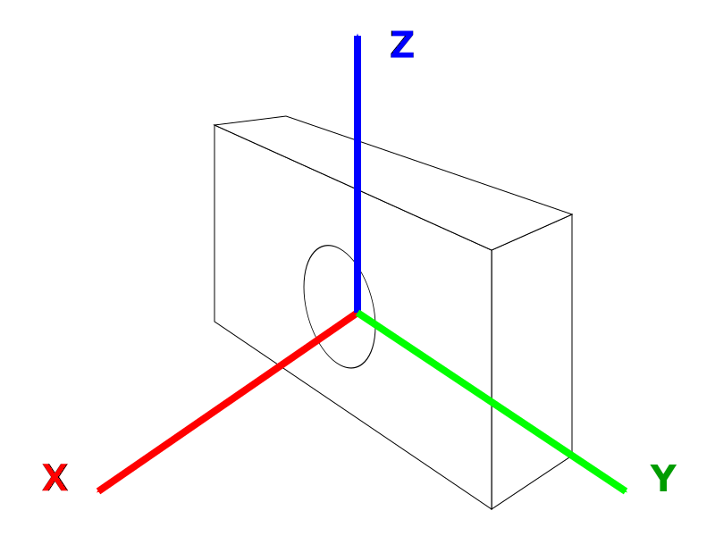
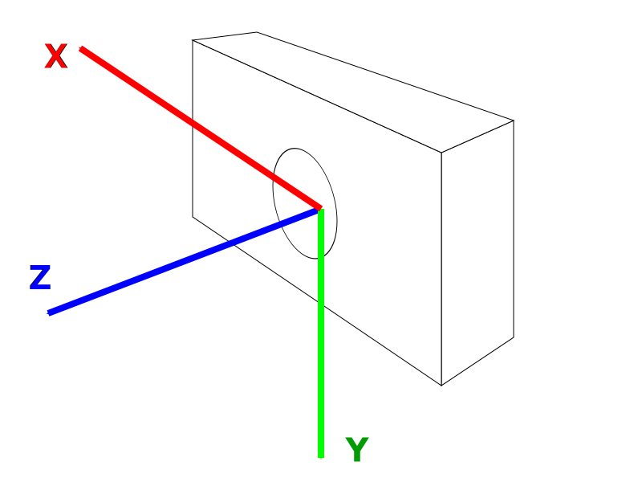
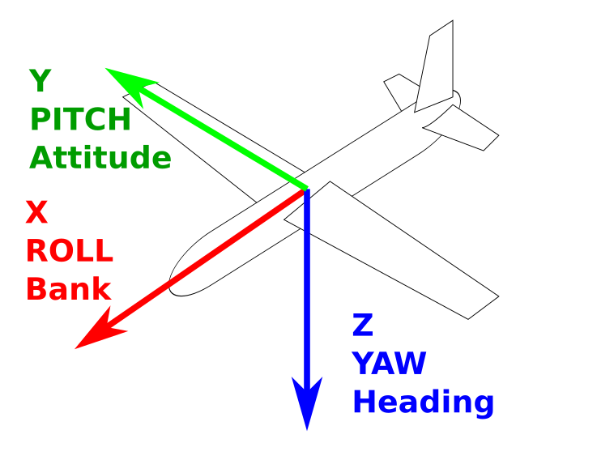
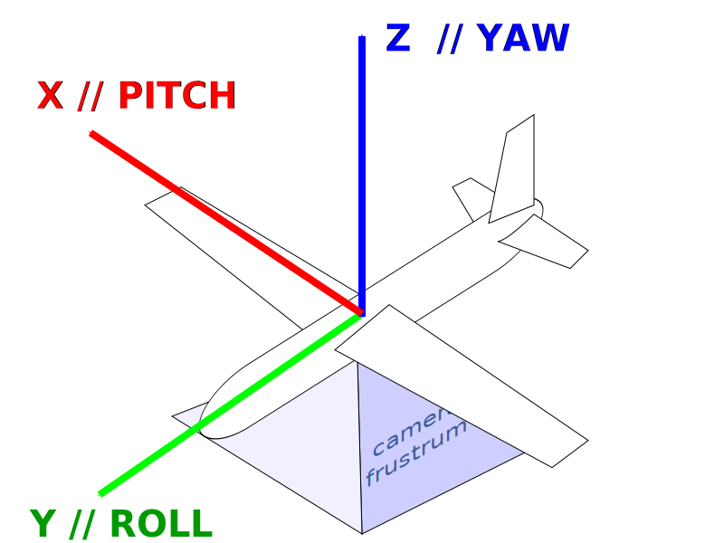

= reference frames
:author: Julien Morat
:email: julien.morat@gmail.com
:sectnums:
:toc:
:toclevels: 1
:experimental:
:stem: latexmath

== notations

 - *points* are noted as column vector as `V = [X, Y, Z] ^T^`,
 - points in *world* (resp. *camera*) frame are denoted `V~w~`, (resp `V~c~`),
 - *pose* is the *position* and *orientation* of the camera into the world, it is denoted `Q`,
 - *position* is the coordinate of an object (eg. the camera center) into the world, it is a 3 vector denoted `t^w^~c~`,
 - *orientation* is the attitude of an object into the world, it is a 3x3 rotation matrix be denoted `R^w^~c~`,
 - *transform* is the inverse of pose, and decomposed into a *translation* and an *orientation*,
 - *translation* is a 3 vector denoted `t^c^~w~`,
 - *rotation* is a 3x3 rotation matrix denoted `R^c^~w~`.

With this notation, the *pose* give the transformation from *camera to world*, like follows:

`V~w~ = R^w^~c~ V~c~ + t^w^~c~` [1]

And the inverse transform from *world to camera*, like follows:

`V~c~ = R^c^~w~ V~w~ + t^c^~w~` [2]

== meaning of pose

TO BE DONE

== homogeneous notation
In *homogeneous coordinates* notations, a additional value is added.
So 3D points have 4 coordinates, and are denoted `Ṽ = [X, Y, Z, W]`.
In homogeneous coordinates, 2 points are equivalent (denoted ≈), if
they are equal up to a scale factor. Then, the *pose* and *transform* are used
like below:

[latexmath]
++++
Ṽ_c  = \left(
\begin{array}{ccc|c}
  &       &  &       \\
  & R^c_w &  & t^c_w \\
  &       &  &       \\
\hline
  &  0    &  & 1
\end{array}
\right)
\times Ṽ_w
++++

[latexmath]
++++
Ṽ_w  = \left(
\begin{array}{ccc|c}
  &       &  &       \\
  & R^w_c &  & t^w_c \\
  &       &  &       \\
\hline
  &  0    &  & 1
\end{array}
\right)
\times Ṽ_c
++++

== pose / transformation conversion

from [1], we can write;

`V~w~ - t^w^~c~ = R^w^~c~ x V~c~`

`(R^w^~c~)^T^ x (V~w~ - t^w^~c~) = V~c~`

`(R^w^~c~^T^ x V~w~) - (R^w^~c~^T^ x t^w^~c~) = V~c~`

`V~c~ = R^w^~c~^T^ x V~w~ -(R^w^~c~^T^ x t^w^~c~)`, [3]

from [2] and [3], we deduce that `R^c^~w~ = R^w^~c~^T^` and `t^c^~w~ = -R^w^~c~^T^ x t^w^~c~`.

Similarly, we can show that `R^w^~c~ = R^c^~w~^T^` and `t^w^~c~ = -R^c^~w~^T^ x t^c^~w~`.

== change reference frame of a pose / transformation

Lets admit we have the *pose* of a camera into reference frame `α`,
but we need to express it into `β` reference frame, ie:

`V~βw~ = R^βw^~βc~ V~βc~ + t^βw^~βc~`.

Assuming transformation between `α` and `β` are pure *rotations* (same origin,
same axis norm, same handness, ...) denoted as `R^α^~β~` and `R^β^~α~`, like :

`V~β~ = R^β^~α~ V~α~` and `V~α~ = R^α^~β~ V~β~`. [4]

From [1], we know

`V~αw~ = R^αw^~αc~ V~αc~ + t^αw^~αc~`

using [4],

`V~αw~ = R^αw^~αc~ (R^α^~β~ V~βc~) + t^αw^~αc~`

`(R^β^~α~ V~αw~) = R^β^~α~ (R^αw^~αc~ R^α^~β~ V~βc~ + t^αw^~αc~)`

`V~βw~ = R^β^~α~ (R^αw^~αc~ R^α^~β~ V~βc~ + t^αw^~αc~)`

`V~βw~ = (R^β^~α~ R^αw^~αc~ R^α^~β~) V~βc~ + (R^β^~α~ t^αw^~αc~)` [5]

consequently,

`R^βw^~βc~ = R^β^~α~ R^αw^~αc~ R^α^~β~` and `t^βw^~βc~ = R^β^~α~ t^αw^~αc~`.

== Axis

=== Gaming

.Gaming axis: X => Front, Y => Left, Z => Up

////
 Note to my self : I would have used svg, but it does not work on the corporate github.
 For security reason, svg is sanitized by github (avoid script injection attack)
 and for some uknown reason, my SVG fails to passe the sanitize process.
see: https://github.com/github/markup/issues/556

 Errors looks like :
 XML Parsing Error: syntax error
Location: https://es.naverlabs.com/raw/julien-morat/memorandum/master/geometry/frame_photoscan.svg?token=AAALOIhufSXBN1XCNvumU8JdpUX1PsCwks5bO3xewA%3D%3D&sanitize=true
Line Number 1, Column 1: 502: Failure
////

=== OpenMVG

.openMVG axis: X => Right, Y => Down, Z => Front

=== Tait-Bryan notation (Aerial)

.Tait-Bryan common axis: X => Front, Y => Right, Z => Down.

The (yaw, pitch, roll) triplet gives the attitude of the plane into the world.
In other words, it transform a point in plane reference frame (denoted `P~c~`)
into a point into world reference frame (denoted `P~w~`).
So `P~w~ = R~yaw~ x R~pitch~ x R~roll~ x P~c~`, with `x` the matrix product.

=== Photoscan

.Photoscan camera axis: X => Right, Y => Up, Z => Back
image:frame_photoscan.svg[photoscan,400,300]

.Photoscan UAV rotation axis: X => pitch (uav-right), Y => roll (auv-front), Z => yaw (uav-down)

WARNING: Photoscan is a beach, and *(yaw, pitch, roll) does not refer to the camera*
apparatus, but to the plane. Since the camera is considered fixed below the
plane, consequently with null yaw, pitch roll, the camera is looking face down,
top border in north direction.

=== 7Scenes

.7Scenes camera axis: X => Right, Y => Up, Z => Back
NOTE: 7Scenes is the same as Photoscan

=== KITTI, 7Scenes

.Like openMVG camera axis: X => Right, Y => Down, Z => Front

NOTE: KITTI and 7Scenes are the same as openMVG.

=== Summary

[cols=">1e,3*^m",options="header"]
|=============================================
| frame name    | X     | Y     | Z

| Gaming        | front | left  | up
| OpenMVG       | right | down  | front
| Tait-Bryan    | front | right | down
| Phtscan World | right | up    | back
| Ptscan UAV    | pitch | roll  | yaw
|=============================================
