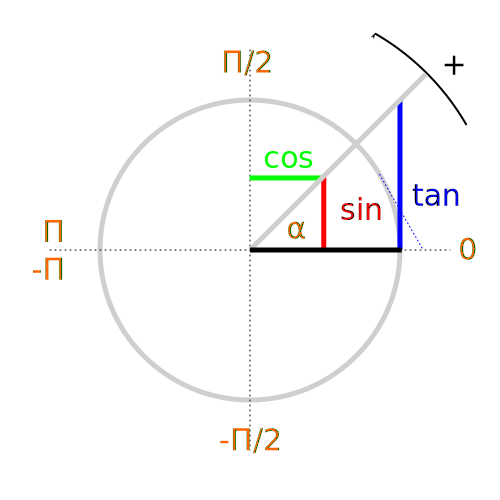

# image:icon_geometry.svg["PYTHON", width=64px] math::geometry

## trigonometry

## Cross-product
 TODO: 
$$
\begin{vmatrix}
\mathbf{a}_1 \\
\mathbf{a}_2 \\
\mathbf{a}_3
\end{vmatrix}
\times
\begin{vmatrix}
\mathbf{b}_1 \\
\mathbf{b}_2 \\
\mathbf{b}_3
\end{vmatrix}
=
\begin{vmatrix}
\mathbf{a}_2 \mathbf{b}_3 - \mathbf{a}_3 \mathbf{b}_2 \\
\mathbf{a}_3 \mathbf{b}_1 - \mathbf{a}_1 \mathbf{b}_3 \\
\mathbf{a}_1 \mathbf{b}_2 - \mathbf{a}_2 \mathbf{b}_1
\end{vmatrix}
$$

NOTE: If two vectors are aligned or if either one has zero length, then their cross product is zero.

image:Cross_product_parallelogram.svg[Cross product vector]

## Dot-product

Takes two equal-length sequences of numbers and returns a single number.
