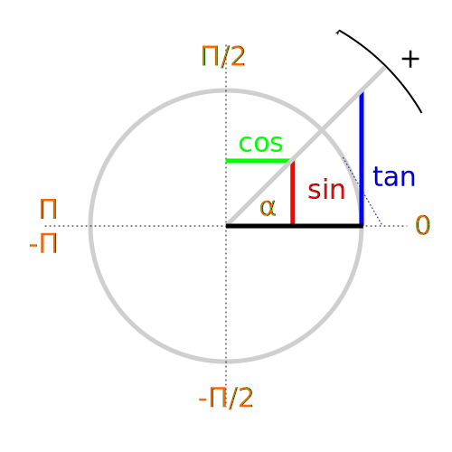

 [MÉMENTO](../README.md)::Geometry
================

trigonometry
------------

Cross-product
--------------

$$
\begin{vmatrix}
\mathbf{a}_1 \\
\mathbf{a}_2 \\
\mathbf{a}_3
\end{vmatrix}
\times
\begin{vmatrix}
\mathbf{b}_1 \\
\mathbf{b}_2 \\
\mathbf{b}_3
\end{vmatrix}
=
\begin{vmatrix}
\mathbf{a}_2 \mathbf{b}_3 - \mathbf{a}_3 \mathbf{b}_2 \\
\mathbf{a}_3 \mathbf{b}_1 - \mathbf{a}_1 \mathbf{b}_3 \\
\mathbf{a}_1 \mathbf{b}_2 - \mathbf{a}_2 \mathbf{b}_1
\end{vmatrix}
$$

_Note_ : If two vectors are aligned or if either one has zero length, then their cross product is zero.

Dot-product
-------------
Takes two equal-length sequences of numbers and returns a single number.
