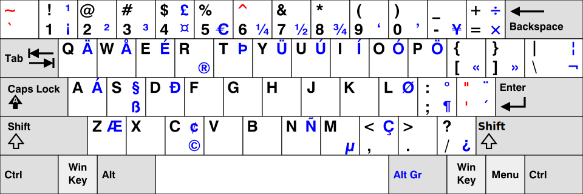

= image:icon_key.svg["KEY", width=64px] Keyboard
julien morat <julien.morat@gmail.com>
:experimental:

== US international with dead keys

== Symbols

[NOTE]
====
* in Windows, type kbd:[Alt+XXX] where `XXX` are the digits of ASCII code,
* in Ubuntu (and inkscape), go into text mode and type kbd:[Ctrl+Shift+U] and the 4-digits unicode.
====

[options="header", cols=">3s,1,1m,1m"]
|==========================================
| Symbol        | glyph | Ascii | Unicode
| infinity      | ∞     | 236   |
| near equal    | ≈     | --    |
| not equal     | ≠     |       |
| plus/minus    | ±     | 0177  |
| alpha (lower) | α     |       | 03b1
| alpha (upper) | A     |       | 0391
| beta  (lower) | β     | 225   | 03b2
| beta  (upper) | B     |       | 0392
| amma  (lower) | γ     |       | 03b3
| amma  (upper) | Γ     |       | 0393
| delta  (lower)| δ     |       | 03b4
| delta  (upper)| Δ     |       | 0394
| epsilon (low) | ϵ     |       | 03b5
| epsilon (upp) | E     |       | 0395
| lambda (lower)| λ     |       | 03bb
| lambda (upper)| Λ     |       | 039b
| mu (lower)    | µ     | 0181  |
| pi (lower)    | π     |       | 03c0
| pi (upper)    | Π     |       | 03a0
| phi  (lower)  | ϕ     |       | 03c6
| phi  (upper)  | Φ     |       | 03a6
| rho  (lower)  | ρ     |       | 03c1
| rho  (upper)  | P     |       | 03a1
| sigma  (lower)| σ     |       | 03c3
| sigma  (upper)| Σ     |       | 03a3
| theta  (lower)| θ     |       | 03b8
| theta  (upper)| Θ     |       | 0398
|==========================================
