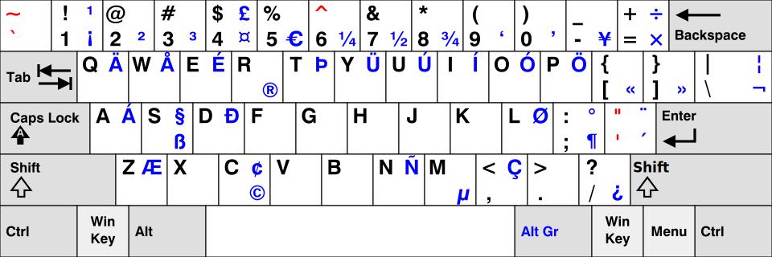

 [MÉMENTO](../README.md)::Keyboard 
================

US international with dead keys
-------------------------------

 Symbols
----------------

_Note_ :
* in windows, type `Alt` + digits of ASCII code,
* in Inkscape, go into text mode and type `Ctrl` + `U` and the 4-digits unicode.

	 Symbol		| glyph	| Ascii	| Unicode 	|
|---------------|-------|-------|-----------|
	 infinity 		| ∞		| 236  	|			|
	 near equal	| ≈		| --	| 			|
	 not equal		| ≠		| 		| 			|
	 plus/minus	| ±		| 0177	| 			|
	 alpha (lower)	| α		|		| 03b1		|
	 alpha (upper)	| A		|		| 0391		|
	 beta	(lower)	| β		| 225	| 03b2		|
	 beta	(upper)	| B		|		| 0392		|
	 amma	(lower)	| γ		|		| 03b3		|
	 amma	(upper)	| Γ		|		| 0393		|
	 delta	(lower)	| δ		|		| 03b4		|
	 delta	(upper)	| Δ		|		| 0394		|
	 epsilon (low)	| ϵ		|		| 03b5		|
	 epsilon (upp)	| E		|		| 0395		|
	 lambda (lower)| λ		|		| 03bb		|
	 lambda (upper)| Λ		|		| 039b		|
	 mu (lower)	| µ		| 0181	|	 		|
	 pi (lower)	| π		|		| 03c0		|
	 pi (upper)	| Π 	|		| 03a0		|
	 phi	(lower)	| ϕ		|		| 03c6		|
	 phi	(upper)	| Φ 	|		| 03a6		|
	 rho	(lower)	| ρ		|		| 03c1		|
	 rho	(upper)	| P 	|		| 03a1		|
	 sigma	(lower)	| σ		|		| 03c3		|
	 sigma	(upper)	| Σ 	|		| 03a3		|
	 theta	(lower)	| θ		|		| 03b8		|
	 theta	(upper)	| Θ		|		| 0398		|

